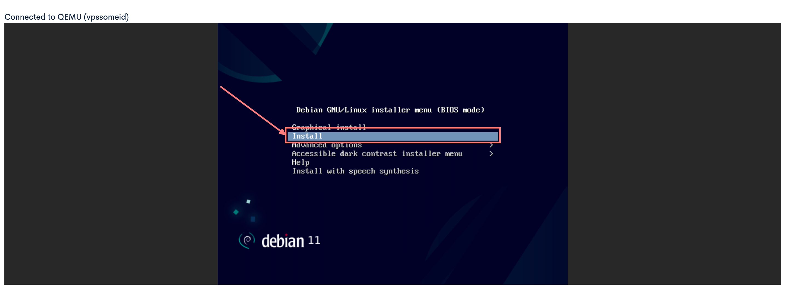
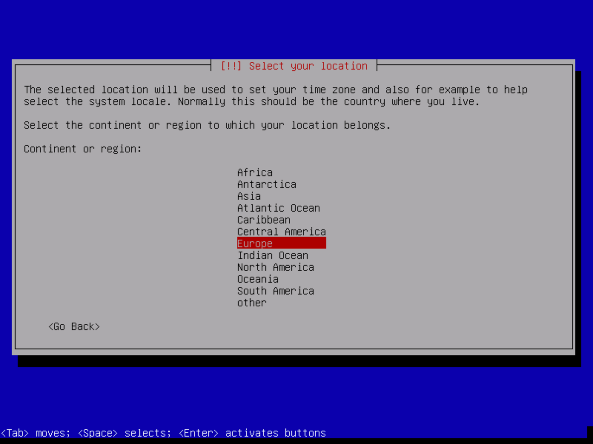
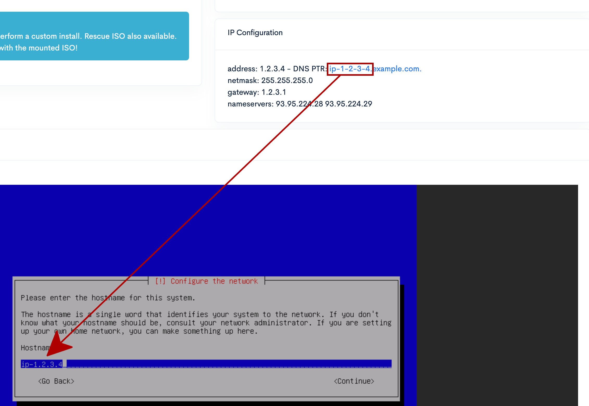
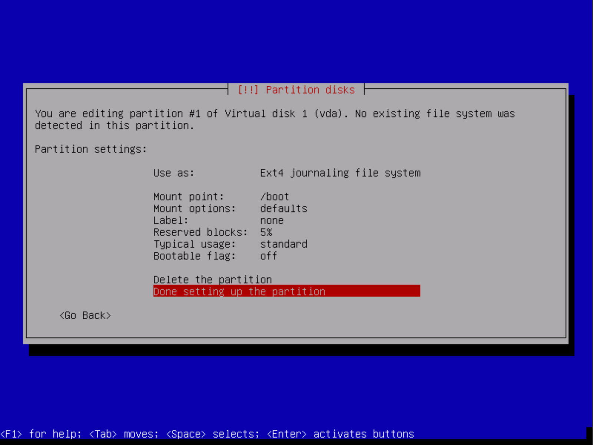

# Install a private and secure Debian 11 on a 1984 server

This will go through the instruction of installing Debian 11 on a VPS on Debian 11.

## Prerequisites

This tutorial assumes that you already registered with 1984, and ordered a VPS which has been delivered.

Even if this tutorial may work with Tor, we encourage you to use a classic browser (Mozilla Firefox) with privacy settings on and through a VPN. You may encounter some issues with Tor in terms of performances of the emulator.

Finally, you don't need any knowledge to follow this tutorial. Each step is well detailed and illustrated so that you should easily be able to follow it even without prior knowledge.

## Setup the VPS

When you arrive on the [home page](https://www.1984hosting.com/) of 1984, click on the [Control Panel](https://1984hosting.com/signin/) link which is on the top right corner:

Sign-in if you need to.

1. Then click on the [Overview](https://management.1984hosting.com/) if it is not already selected
2. Click on the `VPS Control` button of the VPS on which you want to install Debian.

Now, we strongly encourage you to change the reverse DNS name if you own your own domain. If you want to install a web server, or a mail server on it, search engine bots and other email servers will consider you with a slightly better score if the reverse DNS of the IP address is in the same domain.

> We advice you not to choose a service based hostname (like `mail.example.com`), but instead, having an IP based hostname (like `ip-1-2-3-4.example.com`). This because reverse DNS needs an A record matching it, and you don't want to change that. Never. Ever if you change the service you will install on it.
>
> So the best practice, for example for a mail server, would be to have an `ip-1-2-3-4` A record pointing to this IP, and having a `mail` CNAME record pointing to `ip-1-2-3-4`.

Then, click on the black block above the `Click to access the console` label in order to access the console.

1. Click on the label with `- No image mounted -` written on it, and select Debian Bullsey 11.1.0
2. Then click on the `Mount Image` button

In the alert dialog, click on the `Mount ISO and restart`. Then, everything we will do will be on the bottom of this page, where you should see the `Debian GNU/Linux installer menu`.
Just click anywhere on the screen, then you can navigate with your keyboard, using arrow keys, tab and Enter.
Just press the `Arrow Down` key on you keyboard once to select `Install`, and press the `Enter` key on your keyboard.

Normally, English language should be selected. We encourage you to keep English language as we will assume it is the one selected in all the following screens, but feel free to choose an other language if you really feel not comfortable with English language. Just press the `Arrow Down` or `Arrow Up` key to select the language you prefer, and when your choice is made, press the `Enter` key to submit.

Now, the `United States` country should be selected by default. Just press three times on the `Arrow Down` key to select `other`, then press the `Enter` key.

Now, the `North America` continent should be selected. Press two times on the `Arrow Key` key to select `Europe`, then press the `Enter` key.

Now, the `Albania` country should be selected. Press twenty five times on the `Arrow Down` key to select `Iceland`, then press the `Enter` key.

> From now on, we will assume that you know how to select an item using the `Arrow Down`, `Arrow Up` and `Enter` keys. So we will only tell you which value to select, instead of detailing how to select it.

For the locales, keep using the `United States - en_US.UTF-8` as default locale, and press the `Enter` key.

Then the installer will ask you about the keymap to use. Select `American english` and press `Enter` key.

Then, the installer will try to configure the network using DHCP. You have nothing to do but to wait.

After it fails, be sure that `<Continue>` is selected before pressing `Enter`.

Select `Configure network manually` and press `Enter`.

Next screen will ask you to enter the IP address of the server. Just enter the one in the top right block, then press `Enter`.

Next screen will ask you to enter the netmask. Just enter the one in the top right block, then press `Enter`.

Next screen will ask you to enter the gateway. Same as before, pick the one from the top right block, then press `Enter`.

Finally, next screen will ask you about the IP address of the nameservers. Write down the two address you can find on the top right block separated by a space, then press `Enter`.

Then it will ask you your hostname. Just write the first part of your DNS PTR, then press `Enter`.

When it asks you the domain name, just write down the last part of your DNS PTR, then press `Enter`.

Then, the installer will ask you to enter the password you want for the root user. Please put a **strong password**, then press `Enter`.

Then, type again the same password to ensure it was typed correctly, then press `Enter`.

Then the installer will ask you to set-up the first user, and will first ask you to put the real name of the user. We strongly encourage you to use a fake name (for privacy purposes) which looks like a real name (to avoid bugs in programs that may use it), then press `Enter`.

Then, it will ask the username you want to use for this user. Just write down the username you want, but avoid some keywords that may be needed by some programs (`username` or `anonymous` are not good choices here). Then press `Enter`.

Then the installer will ask you to enter the password for this user. Please choose a **strong password**, different from root's password, then press `Enter`.

Same as you did for root, type your user's password again to ensure it has been typed correctly, then press `Enter`.

It's now time to make the partitions of our disks. We will partition our disk the following way :

* A `/boot` partition, size 1GB, which will not be encrypted
* An encrypted volume, size the rest of the disk, which will be encrypted with aes 256, containing:
 * A `/` partition, size 5GB, ext4
 * A `swap area` partition, size matching your RAM
 * A `/data` partition, with remaining space, ext 4, on which we will store the data of the server (databases data, websites, emails, ...)

First, select `Manual` partitioning, and press `Enter`.

Then, select the line matching `Virtual disk 1` and press `Enter` to make sure the disk is empty.

Then press on the `Left Arrrow` key to select `<Yes>` in order to confirm the operation, and press `Enter`.

Then, select the line matching `pri/log - [size] GB  - FREE SPACE` and press `Enter` to create a new partition.

Select `Create a new partition` and then press `Enter`.

Remove the default size, type `1 GB` instead, and press `Enter`.

Keep the type of partition `Primary` selected and press `Enter`.

For the location of the partition, keep `Beginning` selected, then press `Enter`.

Now, select the line `Mount point` and press `Enter`.

Select the `/boot` mount point, then press `Enter`.

Then select `Done setting up the partition` and press `Enter`.

After this, select the `pri/log - [size] GB - FREE SPACE` line, and press `Enter`.

Select `Create a new partition` and press `Enter`.

Keep the default size, which is the remaining free space, and then press `Enter`.

Keep the `logical` type of partition selected, then press `Enter`.

Select the `Use as:` line, and then press `Enter`.

Select `physical volume for encryption`, and then press `Enter`.

Then, select the `Done setting up the partition` and press `Enter`.

Now, select the `COnfigure encrypted volumes` and press `Enter`.

Select `<Yes>` to write changes to the disks and press `Enter`.

Then select `Create encrypted volume` and press `Enter`.

Then, press on the `Arrow down` key to focus on the crypto partition, press the `Space` key to select it.

Then press the `Tab` key to select the `<Continue>` button, and press `Enter`.

Then, select the `Finish` line and press `Enter`.

Use the `Arrow left` key to select the `<Yes>` button in order to confirm erasing data of the partition.

Erasing the data will take some time. All you have to do for now is to wait until it finishes. It will take few minutes, this is totally fine, please don't press `Enter` in order not to cancel it.

Once it is finished, it will ask you a passphrase to unlock the encrypted volume. Feel free to choose a **very strong one**, as it is a key you will rarely type (only on server reboot). Then press `Enter`.

Then, type again the same password to ensure it was correctly typed, and press `Enter`.

Now, select the partition in the encrypted volume that has been created, and press `Enter`

Select the `Use as:` line and press `Enter`.

Select the `physical volume for LVM` line and press `Enter`.

Then, select `Done setting up the partition` and press `Enter`.

Then, select the line `Configure the Logical Volume Manager` and press `Enter`.

Then press the `Arrow left` key to select `<Yes>` button to confirm write of the changes to the disk.

Once you pressed `Enter` after selecting `<Yes>`, you have to configure the partitions. First, select the `create volume group` line, and press `Enter`.

Now write a name for the volume group. The name does not really matters, I simply put `server_vg` where `vg` stands for virtual group. When you're done writing the name of the volume group, press `Enter`.

Select the encrypted volume by using up and down arrow keys, and press `Space` to select. Then press `Tab` key to select `<Continue>`, and press `Enter`.

Now, select the `Create a logical volume` line and press `Enter`.

Keep the `server_vg` group selected, and press `Enter`.

Now you have to write a name for the volume. Just type `root` and press `Enter`.

Now, you have to write down the size of the logical volume. Just remove the value entered, write down `5 GB` and press `Enter`.

Now, select `Create logical volume` again, and press `Enter`.

Once again, select the `server_vg` group and press `Enter`.

For the logical volume name, write down `swap` and press `Enter`.

For the size, just write down the amount of RAM you have on your server. In our case, it is `4 GB`. Then press `Enter`.

And in order to create the last volume, select once again the `Create logical volume` line and press `Enter`.

Same as before, select `server_vg` for the group and press `Enter`.

Then, for the name, just write `data` and press `Enter`.

For the size, just keep the default as it is written, which will take all the remaining free space, and press `Enter`.

Now, select the `Finish` line and press `Enter`.

Now, select the line matching the free space of the `root` volume, and press `Enter`. Below, we have highlighted where you can see the name of the volume.

Now, select the `Use as` line and press `Enter`.

Select the `Ext4 journaling file system` and press `Enter`.

Select the `mount point` line and press `Enter`.

Select the `/ -  the root filesystem` line and press `Enter`.

Then select the `Done setting up the partition` line and press `Enter`.

Now select the line matching the free space of the `swap` volume and press `Enter`.

Select the `Use as` line and press `Enter`.

Select the `swap area` line and press `Enter`.

Then select the `Done setting up the partition` line and press `Enter`.

Last but not least, select the line matching the free space of the `data` volume, and press `Enter`.

Select the `Use as` line and press `Enter`.

Select the `Ext4 journaling file system` and press `Enter`.

Now select the `Mount point` line and press `Enter`.

Then select the `enter manually` line and press `Enter`.

In the nez screen, write `/data` (the `/` should already be written, so you will only have to write down `data`) and then press `Enter`.

Now, just select the line `Done setting up the partition` and press `Enter`.

Finally, select the `Finish partitioning and write changes to disk` line, and press `Enter`.

On the next screen, type the `Arrow left` key to select `<Yes>` to confirm the write of the changes to the disk, and press `Enter`.

That's all about the partitioning. After this, the installer will start installing the base system on the server, and then will prompt you for an other media.

Just keep `<No>` selected, and press `Enter`.

Now, you have to select the country of the mirror you want to use for downloading the debian packkages. As Iceland is not an available option, we suggest you to choose `United Kingdom` which is a good choice for Iceland. Once your selection has been made press `Enter`

Then you have to select the mirror in that country from which you want to get the packages. The default selected one `deb.debian.org` is a good option. Just press `Enter`.

If you don't have any proxy for the connection, which is the case for us, just press the `Tab` key to select `<Continue>` and then press `Enter`.

Then the installer will configure the package manager, install some base softwares, then will ask you if you want to participate to the package survey. We personally trust Debian, but as our goal is to increase privacy to the maximum level, we choose to not participate. If you don't have that strong privacy requirements, feel free to participate. For not participating, just press the `Enter` key.

Then the installer will ask you which softwares you want to install on the machine. For now, just unselect all the selected items by using `Space` key to unselect, and down and up arrow keys to navigate through items. Once all items are unselected, press the `Tab` key to focus on the `<Continue>` button, then press `Enter`.

Then, the installer will install very few softwares, and will ask you whether you want to install GRUB on the primary drive or not. Keep `<Yes>` focused, and press `Enter`.

Now the installer asks you on which drive you want to install GRUB. Select the only drive shown, and press `Enter`.

Then, wait a little bit until the installer finishes the installation. Once done, you should arrive on the below screen.

Then, go to the top of the web page you are currently in, and click on the `Unmount image` button in the `ISO Image` section.

Then the website will warn you that it will reboot the server. Just click on `Eject ISO and restart!` to confirm your choice.

Then wait a little bit until the server restarts. You should know that it has restarted when the Qemu closes and that the website tells you that it is disconnected from Qemu.

You may need to refresh the page to see the Qemu again. It will ask you the passphrase you used to encrypt the disk. Just write it down and press `Enter`.

After you wrote it, then the boot should complete, and prompt you for a login, and then a password.

It means that Debian is well installed, in a secure and private way. Now, what you may want to do first is to [install a firewall](install_firewall.md) on your machine.
