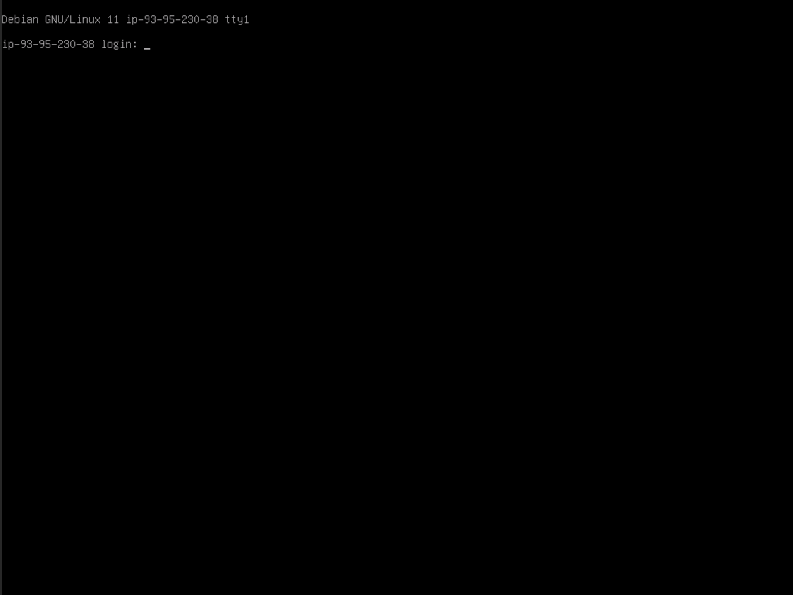
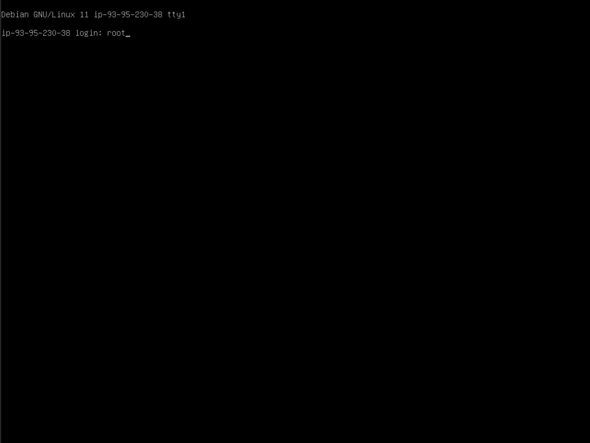
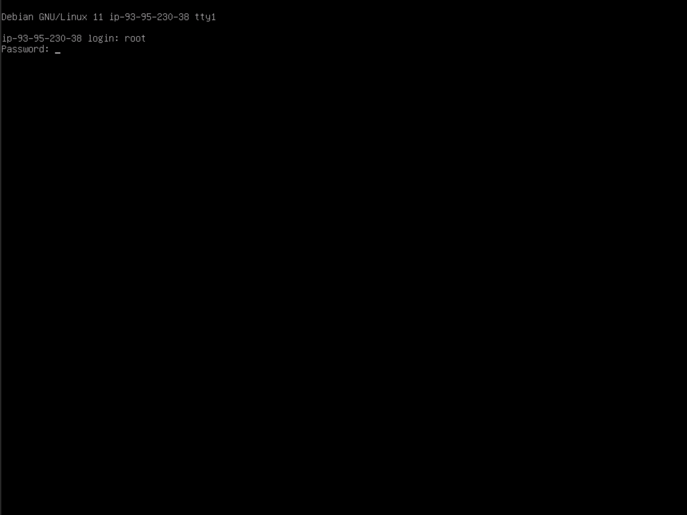
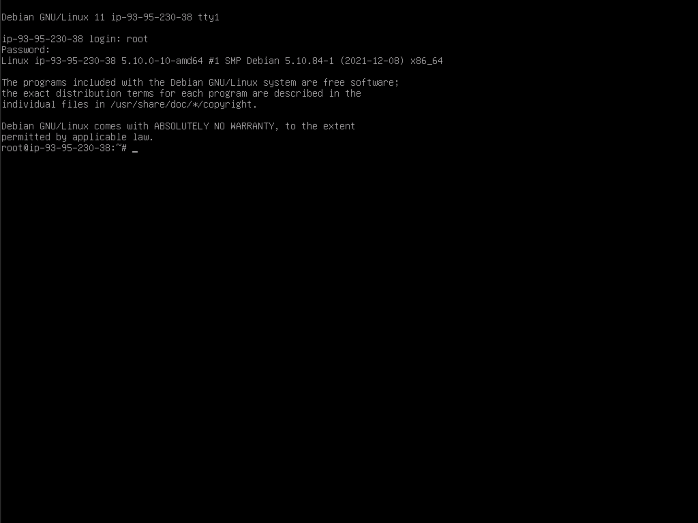
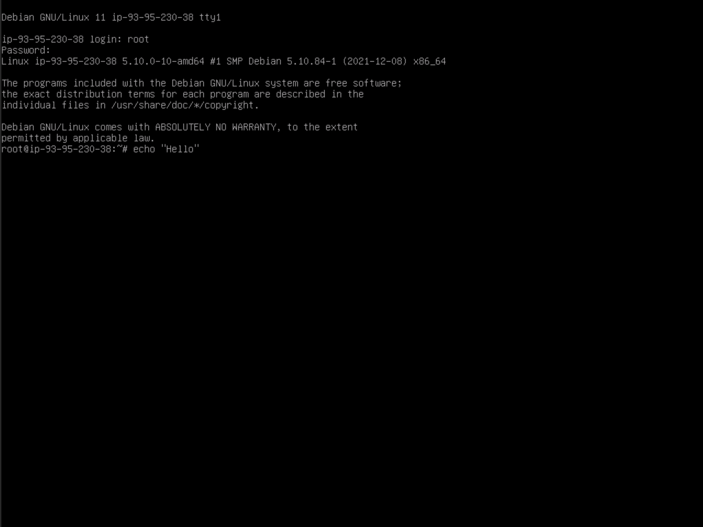
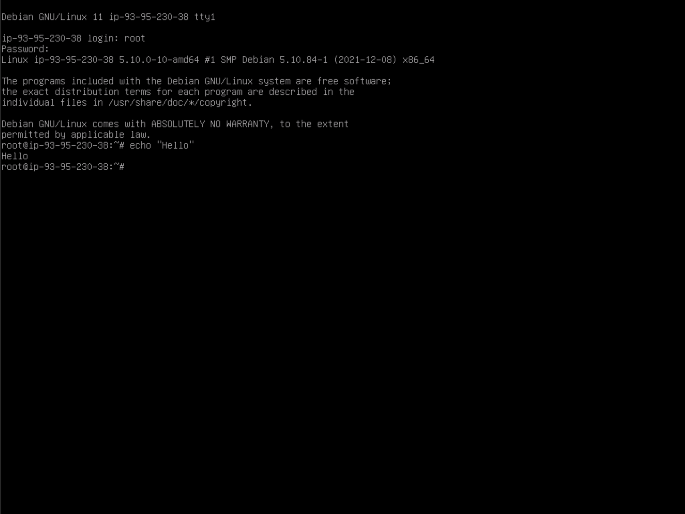

# Install ufw on Debian

Now that you have installed Debian on your server, one of the first thing to do is to install a firewall.

## What is a firewall and why is it useful ?

A firewall is an application on your machine that will block incoming or outgoing traffic on a certain transport protocol (TCP or UDP), on certain ports (0 to 65535).

### Right now, I don't have any firewall on my machine, is it dangerous?

It means that the ports of the application are not closed. Hopefully, if you come from a fresh install, so this is not so dangerous.

An open port is dangerous if and only if a process from your machine is vulnerable. And there is two scenarios, one for outgoing traffic, one for incoming traffic:
* Outgoing traffic might be dangerous, as if an application is vulnerable, or even worse, is a malware, it can go outside and download some dangerous content on your server, then run it.
* Incoming traffic may be dangerous. If you have for example an SSH server, listening on port 22, and if there is a vulnerability in your SSH process, that may be dangerous. A very common issue about it is having an SSH server running on port 22, with login with an SSH key without passphrase which could be retrieved (because an attacker have physical access to your machine, or because you store it publicly like on a public github repository). If your SSH port is open to the world, then an attacker may access your machine.

Right now, you have no deamon using incoming or outgoing traffic. This means that your server is safe, even without firewall, because there is no process an attacker can access.

But of course, as its name suggests, a server is intended to very soon run some of those processes. That's why, before thinking of installing any of those processes, you should install a firewall.

## Which firewall should I install?

In this tutorial, we will install `ufw` which is a very easy to use firewall to start with.

## Install nftables

### Log in as root

First, you need to log in as root on your server. In order to do so, just go to the Qemu of your VPS server, which should now be in that state:



To log in as roo, just type `root` and then press `Enter`.



Then the server will ask for the password of the `root` user. Type it _(as long as you type, you won't see anything, and there won't be any star or anything. It is for security purpose, in order not to show your password length, nor whether you're currently typing your password or not)_. Once you're done typing it, just press `Enter`.



Once you typed `Enter` after typing your password, you should see the following result on the screen:



Now, we will stop sharing the screenshots in this tutorial, and instead, will show you the command. Let's try with a first example. Write down `echo "Hello"` and then, press `Enter`.



After typing `Enter`, you should see the following result:



Instead of showing those screenshot, and saying press `Enter` everytime, we will just say type the following command:

```
echo "Hello"
```

The result of that command should be:

```
Hello
```

### Update and upgrade

First thing we should do now is to update the list of packages:

```
apt update
```

If you're doing it right after the install, you should see a result like this:

```
Get:1 http://security.debian.org/debian-security bullseye-security InRelease [44.1 kB]
Get:2 http://security.debian.org/debian-security bullseye-security/main Sources [76.1 kB]
Get:3 http://deb.debian.org/debian bullseye InRelease
Get:4 http://security.debian.org/debian-security bullseye-security/main amd64 Packages [103 kB]
Get:5 http://deb.debian.org/debian bullseye-updates InRelease [39.4 kB]
Get:6 http://security.debian.org/debian-security bullseye-security/main Translation-en [65.0 kB]
Fetched 327 kB in 1s (256 kB/s)
Reading package list... Done
Building dependency tree... Done
Reading state information... Done
All packages are up to date
```

If you're doing it a little bit after the install, then the result should be longer. Now, it's time to update all the installed packages:

```
apt -y upgrade
```

The result should be:

```
Reading package list... Done
Building dependency tree... Done
Reading state information... Done
Calculating upgrade... Done
0 upgraded, 0 newly installed, 0 to remove and 0 not upgraded
```

If your result differs, and it installed some upgrades, this is something good, you should not worry.

### Install ufw

Just run the following command to install `ufw`:

```
apt -y install ufw
```

This will take some time and install `ufw` and all dependency packages. Now, just enable `ufw`:

```
ufw enable
```

### Block incoming traffic

By default, `ufw` is not blocking any traffic. What we can do in order to see the importance of a firewall, is first to see the incoming and outgoing traffic on our server right now. First, we have to activate the logs:

```
ufw logging medium
```

And now, all we have to do is to write the following command to see all the traffic:

```
tail -f /var/log/ufw.log
```

And you should see many lines appearing for incoming connections. You can see the IP address (`SRC`) of the incoming connections, and the destination port (`DPT`) they are trying to reach. You should mostly see `UFW BLOCK`, meaning that ufw blocked those incoming connections.

And here it is, many bot around the world will try to scan your server, on various ports, to see if some are open and if some vulnerabilities can be found. Hopefully, `ufw` is blocking that traffic, but this can show you the importance of having a firewall.

In order to stop this logs, just type `Ctrl` and `C` keys at the same time.

It's nice and fun to see this, but it also means that all the incoming connections are logged in our server, and for privacy reasons, we want to keep a `no log` policy on our server. There should not be any trace anywhere of incoming connections. So just run the following command to avoid UFW from logging incoming and outgoing traffic.

```
ufw logging off
```

## Exit session

If you want to stop now, and to do something else, it is very important that you log off from your root session with the following command:

```
exit
```
